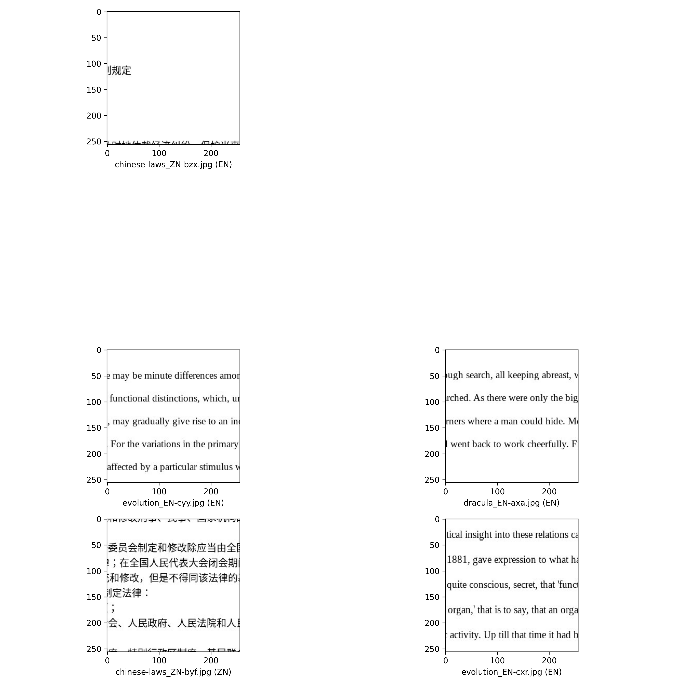
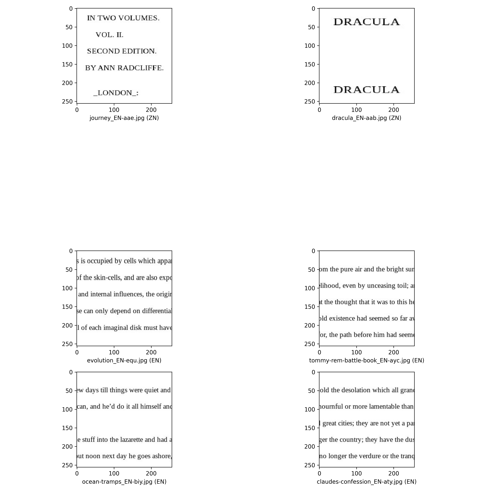
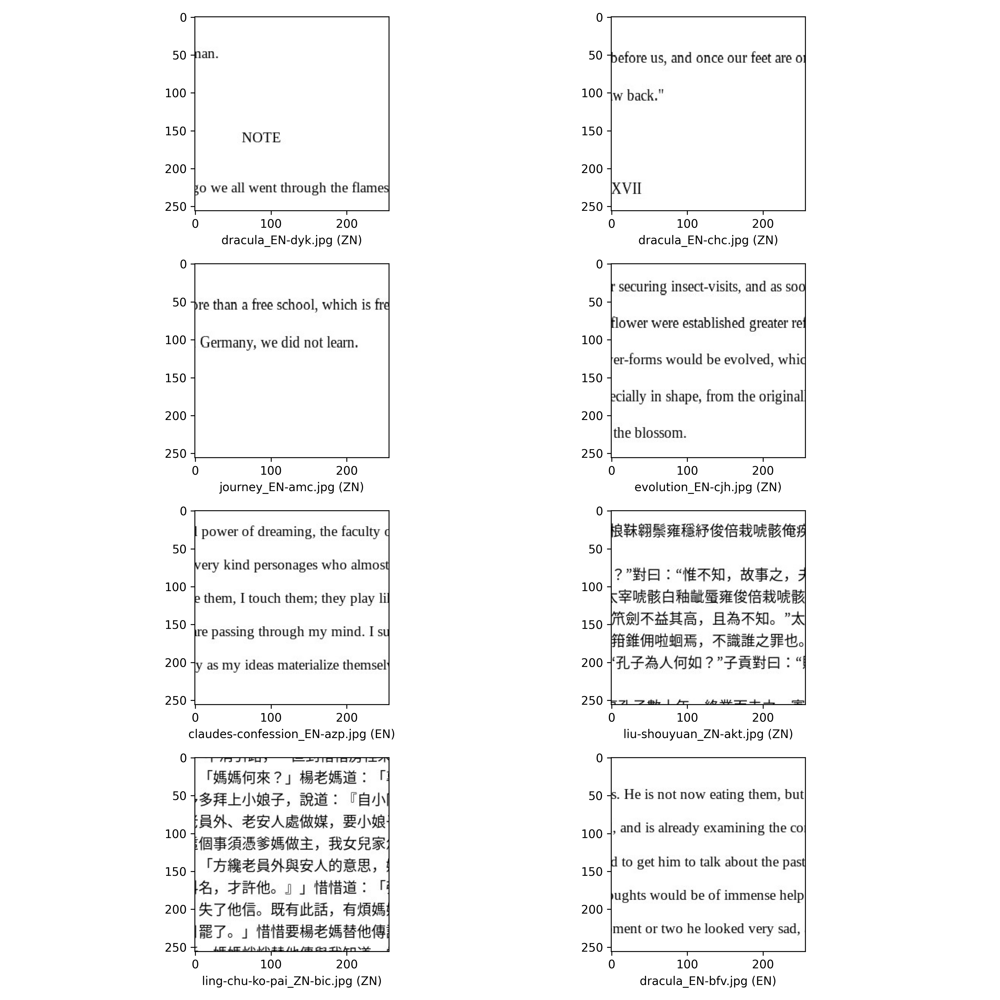
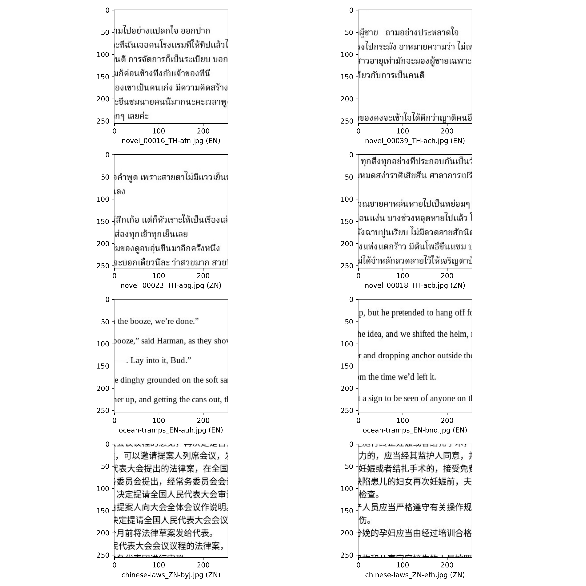
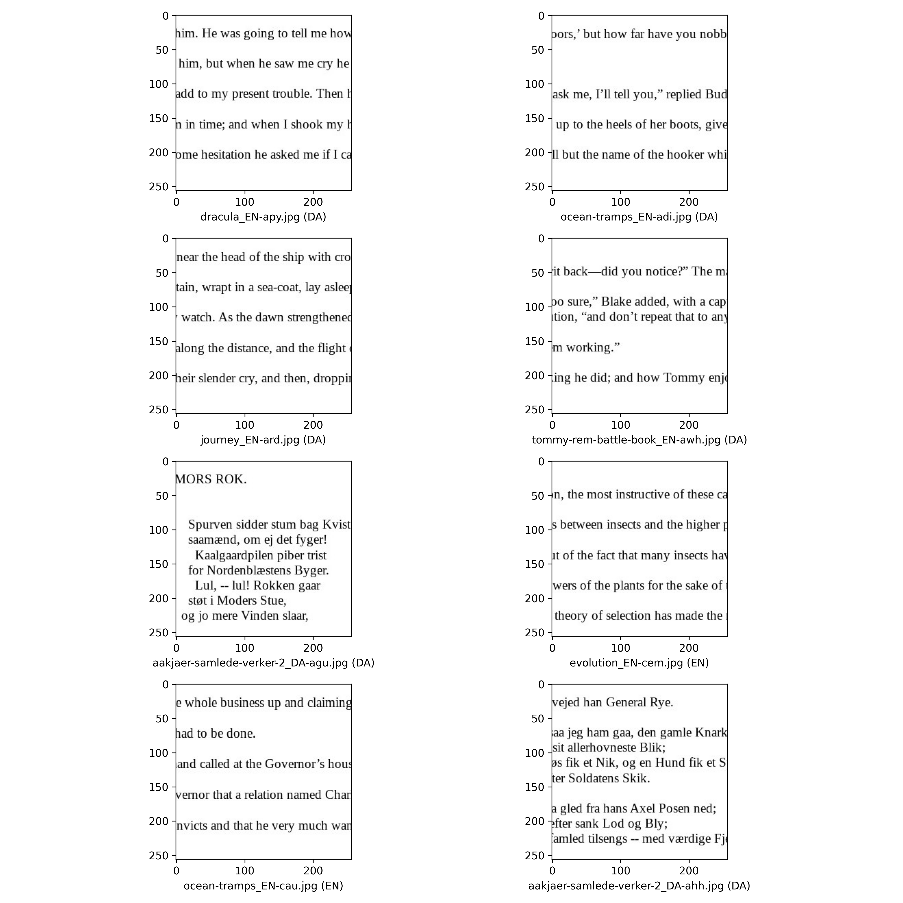

# PS7 findings

By Anthony Zhang, Yixin Lyu, William Wang

## Preparing the environment

In order to get the best result, We decided to run the network training locally on one of our laptops. The specs of the laptop is:

|hardware type| hardware name|
|---|---|
|CPU | 11 gen i7-11800H @ 2.3GHz|
| GPU | Nvidia Geforce RTX 3070 laptop GPU|

We decided to use docker to create the environment. This is way i can skip the process of figuring out which different python packages we need install/missed.

We also allowed GPU processing, which will speed up the training process.

## Preparing the data

to prepare the data, we first get extracted the data and put them in in here a file structure like this:

```
 PS7/
    └── data/
        ├── train
        └── validate
```

Then we run a few commands to get a sense of what the data look like. This is the number from both the training data and the validation data.
```
find . -type f -name "*_EN-*" | wc -l
find . -type f -name "*_DA-*" | wc -l
find . -type f -name "*_RU-*" | wc -l
find . -type f -name "*_ZN-*" | wc -l
find . -type f -name "*_TH-*" | wc -l
```
Number of EN files: 10492 <br/>
Number of DA files: 5114<br/>
Number of RU files: 8204<br/>
Number of ZN files: 6702<br/>
Number of TH files: 9324<br/>


We then took a subset of a 1000 EN files and 1000 ZN files and backed up the rest in `train_big` and `validation_big` folder under the same directory for later use.

```bash
find . -type f -name "*_EN-*" | shuf -n 1000 | xargs -I {} cp {} ../train
find . -type f -name "*_ZH-*" | shuf -n 1000 | xargs -I {} cp {} ../train
```

Finally, we  applied the same logic to the validation dataset and copied 225 `EN` and 225 `ZN` images into the validation folder, along with 50 `DA` images. We choose the number 225, 225, and 50 because they add up to 500. We want to follow the 80:20 split rule. So when we have 2000 images as out training set, we will need 500 image for the validation set.

```bash
find . -type f -name "*_EN-*" | shuf -n 225 | xargs -I {} cp {} ../validation
find . -type f -name "*_ZN-*" | shuf -n 225 | xargs -I {} cp {} ../validation
find . -type f -name "*_DA-*" | shuf -n 50 | xargs -I {} cp {} ../validation
```

## What the code does

### Intro
For this project, we processed a project to construct, train, and assess a convolution neural network (CNN) model to categorize photographs according to the type of written text they include, which are DA: Danish, EN: English, RU: Russian, TH: Thai, ZN: Chinese. This project is a component of a larger challenge to use deep learning methods for picture identification, with a focus on language recognition of text images. To well understand the code we gave, I would like to separate them into a few parts to explain:

### Creating Model:
After downloading and testing the dataset, the first part we did was to create the model. We used a ‘Sequential’ model from Keras, which works well with a layer stack in which there is precisely one input tensor and one output tensor for each layer. In this model architecture, two layers played an important role. 

To prevent overfitting, a 2D convolutional layer (Conv2D) with ReLU activation is followed by batch normalization, max pooling, and dropout. It performs a convolution operation for the upcoming data working. This entails calculating the dot product between the filter weights and the input pixels each filter covers at each point when it is slid across the input image (both horizontally and vertically). In our project, we can change the number of parameters by changing the number of filters (or kernels) used in the convolution operation and the kernel_size (the size of the filter matrix). Also, we can change the clarity of the image by changing the stride size. When we increased the stride size, it would essentially reduce the resolution of the input text image in the feature map output. Conversely, when we decrease the stride size, it expands the feature map's spatial dimensions upon output. This makes it possible to analyze the image in greater depth and capture the image's finer details.

The two ‘Dense’ layers are also important for creating the model, the first ‘Dense’ layer is to interpret the feature. The ‘kernel_initializer = initializers.HeNormal()’ argument specifies the initialization method for the weights. Also, when we change the units of the Dense, it would impact the capacity and performance of the neural network. For example, if we reduce the number of Denser units, it will help mitigate overfitting when the model is complex. The second ‘Dense’ layer is for classification. It intended to assign each image to a specific linguistic category. This layer has the same number of neurons as the number of language categories we are attempting to predict.

### Training and validation data generator & Model Training:
For this part, we used the ‘ImageDataGenerator’ function, which is a technique to increase the diversity of the training dataset without explicitly increasing the number of images. One important finding for this part is to change the size of the epoch, which would impact both performance metrics and the risk of overfitting or underfitting. When we increase the size of the epoch, it will lead to higher accuracy on the training dataset. However, it will also increase the possibility of overfitting. When we decrease the size of the epoch, it will increase the possibility of underfitting, but it will shorten the training time, which will make the process more efficient. The findings below clearly show this. 

###	Validation data preparation & Categorical prediction:
For this part, we made a validation process to categorize data for different languages and made categorical predictions. Filenames and the associated categories are used to build a data frame called ‘validationResults’. The existence of particular substrings (EN for English, DA for Danish, and others designated as Unknown) in the filenames determines the category. After that, we used the ‘ImageDataGenerator’ function again to create an instance for the validation data with only ‘rescale=1./255’ applied to normalize the image pixel values. After that, we add the predicted category indices to the data frame and get the predicted probability array shape. In comparison with the actual categories, we got the confusion matrix and validation accuracy at the end of this part. Also, we can get the wrong results in validation data.

### Visualization:
As the last part of our project, to visualize the comparisons we have derived, we have chosen to present the four correct outputs and four wrong outputs to show the differences, which helps point out any persistent biases or flaws in the model and in directing future enhancements to the training procedure, data preparation, or model design.


## Getting the code to work

Based on the code we got in last week's lab, we researched and adjusted it. In comparison with the `square-circle-cross` code, the language data have more complex categories and relatively clear output. In that case, we adjusted it, and the script will map the training data based on the language:

```python
trainingResults = pd.DataFrame({
    'filename': filenames,
    'category': np.where(pd.Series(filenames).str.contains('EN'), 'EN',
                         np.where(pd.Series(filenames).str.contains('ZN'), 'ZN', 'Unknown'))
})
```

We also applied the same logic in the later validation dataframe:

```python
validationResults = pd.DataFrame({
    'filename': fNames,
    'category': np.where(pd.Series(fNames).str.contains('EN'), 'EN',
                np.where(pd.Series(fNames).str.contains('ZN'), 'ZN',
                np.where(pd.Series(fNames).str.contains('DA'), 'DA', 'Unknown')))
})
```

Finally, we changed the code defining image properties:

```python
targetWidth, targetHeight, channels = 256, 256, 1
```

Afterward the code runs. From the 1000 EN and ZN images, we get a validation accuracy of 0.89. This is with a network of (64, 128, 128, 128), kernel size 3, stride 1, and 10 epochs.

the confusion matrix:

predicted category |   EN  | ZN|
|---|---|---|
|DA         | 49    |1|
|EN   |       221  |   4 |
|ZN      |      1  | 224 |


## Test language

### Attempt 1
Now let play with this network.

The first thing that needs to be done is increase the sample size. Hence we will use 5000 image from each languages(EN, ZN) for training and 1000 images for each language for testing.

So for the first attempt, we have a neural network of layer (64, 128, 128, 128), which in total uses 63072386 parameters and we trained the network for 10 epochs.

For this attempt we get a validation accuracy of 0.9995. however, it took about 43 minutes to run, which is pretty long training time. 

Here is the confusion matrix for this attempt:

|predicted category    |EN   |ZN|     
|---|---|---|
|EN         |1000    |0|
|ZN|            1|999|

we can see that we identified one chinese image wrong. If we print it out, we can see that it is because that particular image do not have many feature points to begin with. Most of the space in the image is empty. The chinese characters shown on there has been cut in half.


The first image on the top is the wrongly predicted images.

So overall, this is a pretty accurate model. However, the the down side is that the training time is too long.

### Attempt 2

So for my second attempt, I want reduce the training time by reducing the layers from 4 to 2, which means we'll get rid of one Conv2d layer and one dense layer. 

Surprisingly, doing this have increased my number of parameters from the previous 63072386 to 132130562. On a closer look however, this makes a lot of sense. By getting rid of the Conv2D layer, we also got rid of the pooling layer, which was responsible for reduces the number of parameters. Thus, the total number of parameters increases when such parameters mask the flattening layer.

The second attempt took about 8.6 minutes and resulted in a validation accuracy of 0.999. The result confusion matrix is the following:

|predicted category    |EN   |ZN|     
|---|---|---|       
|EN         |998     |2|
|ZN           |0  |1000|


We can see that the frequency of wrong predict increased by 1, which is not so much given that we have cut down the training time by roughly 3/4. Here some demo on the image prediction:



Additionally, as the top two images demonstrate, we are still confronted with the same issue as the last attempt: a large amount of white space in the image appears to reduce the model's effectiveness. This issue appears to be caused by the fact that most images contain very little white space, which means the model doesn't have a lot of data to train on.

### Attempt 3

So in order to fix this problem, we will try and use the original training data set with all the EN images and ZN images. 

So this leave us with 8442 EN and 5396 ZN training images and a total parameter of 32515842.

The result produced a validation accuracy is 0.985 with a training time of roughly 10.5 minutes. and the confusion matrix is this:

|predicted category    |EN   |ZN|     
|---|---|---|       
|EN         |2001    |49|
|ZN|            0|  1306|

.

This shows that it was not an equal trade between the increase in training sample and increase in strides. The quality of the model decreased with the increase of strides from 1 to 2.

## Adding more language.
### Attempt 4

So for attempt 4, we added one language - Thai data to train our model. And we yielded 63% validation accuracy for three languages.

Here is the confusion matrix: 
|matrix predicted category | EN | TH |   ZN|
|---|---|---|---|          
|EN   |      2037 |  6   |  7|
|TH        |  395 |  9 | 1495|
|ZN    |        1  | 0 | 1305|

Therefore, we found that as the complexity of the data increased from 2 types to 3 types, the accuracy took hit when the networks remain to be the same.



### Attempt 5

In order to increasing the accuracy of the model, we attempted to add a dense layer with 128 nodes. Nonetheless, we discovered that the validation accuracy stays at roughly 63.8%. We were perplexed as to why a dense layer cannot be added. Overfitting or declining returns was our conjecture.

Here is the confusion matrix:

|predicted category|  EN | TH |   ZN|
|---|---|---|---|           
|EN   |      2049   |  1|0|
|TH     |    1830  |  69|0|
|ZN |           3 | 1303|0|

### Attempt 6

To keep increasing the accuracy of the model, we added other convolution layer with 128 nodes and MaxPooling2D. This does increased the validation accuracy to 73.7% and decreased our parameter.

|predicted category|  EN | TH |   ZN|
|---|---|---|---|       
|EN|         2049|    0|     1|
|TH            |3  |524  |1372|
|ZN|            7|    0|  1299|

### Attempt 7

In order to keep simplifying the model, we would like to keep reducing the number of parameters. As a result, we decided to remove one Dense layer and replace it by a Average Pooling Layer. 

The number of parameters decrease significantly from 63073411 to 15821444. However, the training time shot up to a staggering 1 hour and 40 minutes, and validation accuracy was only at 0.68, which is quite low.

|matrix predicted category|  EN | TH |   ZN|
|---|---|---|---|    
|EN|         2033|    5|    12|
|TH         |1574  |241    |84|
|ZN|            3|   21|  1282|

## EN vs DA

Now we want to focus on making the model differentiate between EN and DA

### Attempt 8

Since we have the GPU, we decided to just continue with using all of the EN and DA images in the data set.

We choose to start with identifying EN and DA images after learning previously that utilizing only two hidden layers might get a relatively respectable validation score.

So with this attempt, we ran the training for about 13 minutes, which is relatively fast.

And we get the validation score of 0.84. This was lower when we tried the same method on classifying EN image to ZN.

The confusion matrix look like this:

|predicted category|  DA | EN |
|---|---|---|
|DA|         808|   211|
|EN         |274  |1776|

### Attempt 9

Finally, we tried adding one more Conv2d Layer since previous attempt shows that adding both the Conv2d layer and dense layer result in super long training time. We also increased the stride to 2 for the same reasons

We finished the training in 12 minute got the validation score of 0.65. This was a little big surprising because we thought the added complexity should have increased the validation accuracy. This shows that the increase in stride have more influence in the validation accuracy than added layers. By adding this layer, it facilitates the network's ability to more effectively gather the necessary characteristics required to discern between English and Danish in the text pictures.

|predicted category|  DA | EN |
|---|---|---|          
|DA |       1019  |  0|
EN     |    1064  |986|

From the graphing we can see that a lot of English images was recognized  as Danish. There were no distinct characteristic of those wrongly categorized images compare to those who is correctly categorized. This once gain prove the difficulty of separating English and Danish.



## Conclusion

So overall, we can see that separating EN and ZN images are fairy easy. This is mostly likely because Chinese is a hieroglyphic language and all of its characters resemble the shape of a square. This square-like feature distinguish its elves from language like English, which relies entirely on the 26 alphabetical letters. The highest validation accuracy we have reached is 0.999 with two hidden layers (1 Conv2D and 1 dense layer) in around 8 to 9 minutes of training time with 10 epochs. However, this is with a limited data set. When we used the "full dataset", we reached a validation accuracy of 0.985. 

|predicted category    |EN   |ZN|     
|---|---|---|       
|EN         |2001    |49|
|ZN|            0|  1306|

EN, ZN and TH are harder to distinguish compare to the just EN and ZN. This is partially due to the added complexity of trying to distinguish 3 language instead of 2, and because compare to the distinct contrast between EN and ZN, EN and TH is harder to distinguish. Although from the human perspective TH is obviously different from EN, their letter like symbols is similar to that of English in the network's perspective.
For this set of data we reached maximum of 0.737 using 4 hidden layers: two Conv2D　layer, two dense layer. The training time for this around 24 minutes, which is an obvious increase from before. 

|predicted category|  EN | TH |   ZN|
|---|---|---|---|       
|EN|         2049|    0|     1|
|TH            |3  |524  |1372|
|ZN|            7|    0|  1299|

Finally, EN and DA is also very hard to distinguish. This is due to the fact that Danish and English essentially utilize the same alphabet. With two hidden layers—one Conv2d and one Dense—we were able to achieve a maximum validation accuracy of 0.84 in about 13 minutes. After that, we increased the strides to two and the hidden layers to three, which led to a lower accuracy of 0.65.  This implied that the number of layers may not have as much of an impact on validation accuracy as expected.

|predicted category|  DA | EN |
|---|---|---|
|DA|         808|   211|
|EN         |274  |1776|